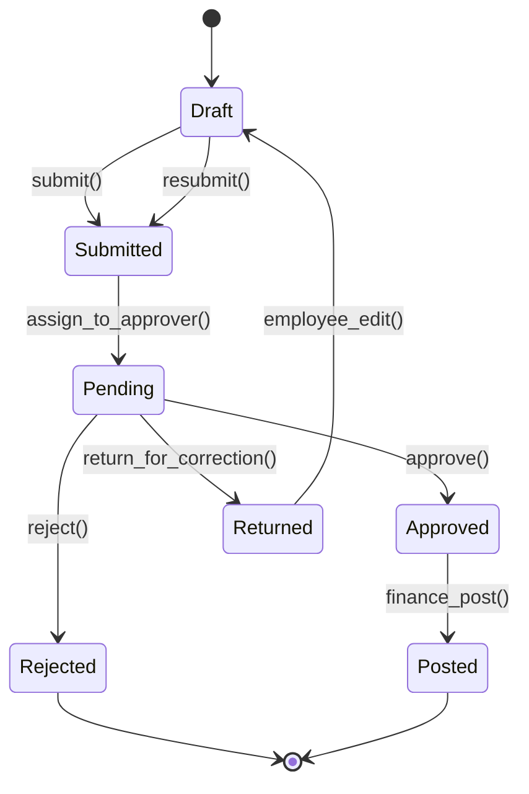

# Software Requirements Specification: Expense Roles & Workflows (v3.0)

## Document Control
- **Version:** 3.0
- **Date:** January 27, 2026
- **Status:** Implementation Ready
- **Previous Version:** 2.2
- **Technology Stack:** Hono (Node.js/TypeScript), PostgreSQL, JOSE (JWT), OpenAPIHono (Zod)
- **Change Summary:** Major security enhancements, compliance requirements, and workflow robustness improvements

---

## 1. User Roles & Access Control (RBAC/ABAC)

### 1.1 Core Role Definitions

| Role | Access Scope | Default Permissions | Notes |
|:-----|:------------|:--------------------|:------|
| **Employee** | Personal Records | `report.create`, `report.edit.own`, `report.view.own`, `report.submit` | Cannot approve own reports |
| **Approver** | Subordinate Records | `report.view.team`, `report.approve`, `report.reject`, `report.return` | Requires organizational hierarchy |
| **Finance** | Global (Read/Post) | `report.view.all`, `report.post`, `report.export`, `analytics.view` | Cannot approve or edit |
| **Auditor** | Global (Read-Only) | `report.view.all`, `audit.view`, `audit.export` | Cannot modify any data |
| **Admin** | Global (Full) | All permissions + `role.*`, `user.*`, `workflow.*`, `system.*` | Subject to separation of duties |
| **Super Admin** | System Level | `admin.*` + `role.assign.admin`, `system.configure` | Database-only assignment |
| **Custom** | Defined by Admin | Mapped from Permission Registry | Max 50 custom roles per org |

### 1.2 Permission Registry

#### 1.2.1 Permission Structure
Permissions follow a hierarchical dot notation with wildcard support:

```
resource.action[.scope]

Examples:
- report.*              (all report actions)
- report.view.all       (view all reports)
- report.view.own       (view own reports only)
- role.manage           (create/edit roles)
- role.assign           (assign roles to users)
```

#### 1.2.2 Core Permissions

**Report Management:**
- `report.create` - Create new expense reports
- `report.edit.own` - Edit own draft/returned reports
- `report.edit.all` - Edit any report (restricted)
- `report.view.own` - View own reports
- `report.view.team` - View subordinate reports
- `report.view.all` - View all reports
- `report.submit` - Submit reports for approval
- `report.approve` - Approve reports
- `report.reject` - Reject reports
- `report.return` - Return reports for correction
- `report.delete.own` - Delete own draft reports
- `report.post` - Post approved reports to accounting
- `report.export` - Export report data

**Administrative:**
- `role.create` - Create new roles
- `role.edit` - Edit role permissions
- `role.delete` - Delete roles
- `role.assign` - Assign roles to users (except Admin)
- `role.assign.admin` - Assign Admin role (Super Admin only)
- `user.view` - View user information
- `user.edit` - Edit user profiles
- `user.deactivate` - Deactivate users
- `workflow.create` - Create approval workflows
- `workflow.edit` - Edit workflows
- `workflow.assign` - Assign workflows to departments/types
- `audit.view` - View audit logs
- `audit.export` - Export audit logs
- `system.configure` - System configuration

**Analytics:**
- `analytics.view` - View reports and dashboards
- `analytics.export` - Export analytics data

#### 1.2.3 Permission Assignment
- **Role Mapping:** Admins assign permissions to roles via the Permission Registry
- **Multi-Role Support:** Users can have multiple roles; effective permissions = **Union** of all role permissions
- **Permission Conflicts:** Most permissive rule wins (allow overrides deny)
- **Explicit Deny:** Not supported; removal = revocation

### 1.3 Separation of Duties (SoD)

#### 1.3.1 Toxic Permission Combinations
The system MUST prevent assignment of these permission combinations to any single role:

| Combination | Risk | Enforcement |
|:------------|:-----|:------------|
| `report.edit.all` + `report.approve` | Approval of manipulated reports | Block at role creation |
| `report.approve` + `report.post` | Bypassing financial review | Block at role creation |
| `role.create` + `role.assign.admin` | Privilege escalation | Super Admin only |
| `user.edit` + `role.assign` | Unauthorized access grant | Require approval workflow |
| `audit.export` + `report.edit.all` | Evidence tampering | Block at role creation |

#### 1.3.2 Self-Transaction Restrictions
The system MUST prevent:
- **Direct Self-Approval:** User cannot approve reports where `report.user_id == session.user_id`
- **Circular Approval:** User A approves User B's report, then User B approves User A's report within 30 days
- **Same-Entity Approval:** Users sharing same cost center/department cannot approve each other's reports exceeding $1,000
- **Temporal Separation:** Users who edited/returned a report cannot approve it in the same workflow cycle

### 1.4 Enhanced Session Management

#### 1.4.1 JWT Structure
```json
{
  "jti": "unique-jwt-id-v4-uuid",
  "sub": "user-id",
  "roles": ["employee", "approver"],
  "roles_version": 5,
  "permissions": ["report.create", "report.approve"],
  "iat": 1706342400,
  "exp": 1706344200,
  "refresh_token_id": "refresh-token-uuid"
}
```

#### 1.4.2 Version-Based Invalidation
Replace Redis blacklist with version counter:

**On Role/Permission Change:**
1. Increment user's `roles_version` in database
2. New tokens issued with updated version
3. Existing tokens fail validation on next request

**Validation Logic:**
```python
if token.roles_version != db.get_user_roles_version(token.sub):
    return 401  # Token invalidated
```

**Benefits:**
- No distributed cache required
- Instant invalidation on next request
- Scales horizontally
- No single point of failure

#### 1.4.3 Token Lifecycle
- **Access Token TTL:** 15 minutes
- **Refresh Token TTL:** 7 days
- **Refresh Token Rotation:** New refresh token issued on each use
- **Refresh Token Revocation:** Stored in database with `revoked_at` timestamp

### 1.5 Enhanced Session Security

**Requirements:**
- **Session Duration:** 
  - Access Token: 15 minutes (configurable)
  - Refresh Token: 7 days (configurable)
  - Admin Role: Recommend shorter session duration (1 hour refresh token)
- **Session Management:**
  - Track active sessions per user
  - Allow users to view and revoke sessions
  - Automatic logout on suspicious activity
- **IP Address Tracking:**
  - Log IP address for each session
  - Alert on login from new location (optional)
- **Concurrent Session Limits:**
  - Configurable per role (default: 5 sessions)
  - Oldest session auto-revoked when limit exceeded

---

## 2. Approval Workflows

### 2.1 Workflow Engine Architecture

#### 2.1.1 Workflow Definition
```json
{
  "workflow_id": "uuid",
  "name": "Standard 3-Level Approval",
  "version": 2,
  "active": true,
  "created_at": "2026-01-01T00:00:00Z",
  "updated_at": "2026-01-15T00:00:00Z",
  "steps": [
    {
      "step_number": 1,
      "name": "Direct Manager Approval",
      "target_type": "relationship",
      "target_value": "direct_manager",
      "conditions": {
        "amount_min": 0,
        "amount_max": 10000
      },
      "sla_hours": 48,
      "escalation_target": "skip_level_manager"
    },
    {
      "step_number": 2,
      "name": "Finance Review",
      "target_type": "role",
      "target_value": "finance",
      "conditions": {
        "amount_min": 1000
      },
      "sla_hours": 72,
      "escalation_target": "finance_director"
    }
  ]
}
```

#### 2.1.2 Step Target Types

**Role-Based:**
- `target_type: "role"`
- `target_value: "finance"` (role name)
- Any user with the specified role can act

**Relationship-Based:**
- `target_type: "relationship"`
- `target_value: "direct_manager" | "skip_level_manager" | "department_head"`
- Resolved dynamically per report submitter

**Hybrid:**
- `target_type: "hybrid"`
- `target_value: {"role": "approver", "relationship": "same_department"}`
- Must satisfy both conditions

#### 2.1.3 Conditional Routing
Workflows support dynamic step selection based on:
- **Amount Thresholds:** Different paths for <$500, $500-$5000, >$5000
- **Expense Category:** Travel vs. Equipment vs. Services
- **Department:** Engineering vs. Sales vs. Operations
- **Location:** Domestic vs. International

### 2.2 Workflow Execution

#### 2.2.1 State Machine
```
Draft → Submitted → [Approval Steps] → Approved → Posted
                  ↓
              Returned → Draft (restart workflow)
                  ↓
              Rejected (terminal)
```

#### 2.2.2 Workflow Locking
When a report is submitted:
1. **Capture Snapshot:** Store complete workflow definition with report
2. **Lock Version:** Report uses workflow version from submission time
3. **Prevent Orphaning:** Admin cannot delete workflow with in-flight reports

**Exception Handling:**
- Admin can force-migrate in-flight reports to new workflow version
- Requires `workflow.force_migrate` permission
- Generates audit log entry with justification

#### 2.2.3 Restart Policy
When a report is "Returned for Correction" and resubmitted:

**Hard Restart (Default):**
- Workflow restarts from Step 1
- All previous approvals cleared
- New workflow version applied if changed
- Previous approvers notified of resubmission

**Soft Restart (Configurable):**
- Workflow resumes from last incomplete step
- Previous approvals retained
- Original workflow version maintained
- Only changed sections re-reviewed

### 2.3 SLA & Escalation

#### 2.3.1 Automatic Escalation
- **Trigger:** Step not completed within `sla_hours`
- **Action:** Notify `escalation_target` (role or relationship)
- **Reminders:** 50%, 75%, 90% of SLA elapsed
- **Auto-Approve:** Low-value reports (<$100) auto-approve after 2x SLA

#### 2.3.2 Escalation Matrix
| Report Amount | SLA (Hours) | Escalation Target | Auto-Approve |
|:--------------|:------------|:------------------|:-------------|
| $0 - $100 | 24 | Skip-level manager | Yes (48h) |
| $101 - $1,000 | 48 | Skip-level manager | No |
| $1,001 - $5,000 | 72 | Department head | No |
| $5,001+ | 96 | Finance director | No |

### 2.4 Rejection & Return

#### 2.4.1 Mandatory Feedback
All rejection/return actions require:
- **Comment:** Minimum 10 characters
- **Category:** Dropdown selection (e.g., "Missing receipt", "Policy violation", "Duplicate")
- **Suggested Action:** Text field for employee guidance

#### 2.4.2 Return vs. Reject
- **Return for Correction:** Report goes back to Draft, employee can resubmit
- **Reject:** Terminal state, report archived, employee must create new report
- **Decision Matrix:** System suggests action based on issue category

---

## 3. Expense Report Lifecycle

### 3.1 Status States & Transitions



### 3.2 State Permissions

| Status | Employee Actions | Approver Actions | Finance Actions | Admin Actions |
|:-------|:----------------|:-----------------|:----------------|:--------------|
| **Draft** | Edit, Submit, Delete | None | None | View, Delete |
| **Submitted** | View, Withdraw | None | None | View, Reassign |
| **Pending** | View | Approve, Reject, Return | View | View, Reassign |
| **Returned** | View, Edit, Resubmit | None | None | View, Delete |
| **Approved** | View | View | Post, Export | View |
| **Rejected** | View | View | View | View, Restore |
| **Posted** | View | View | View, Export | View |

### 3.3 Data Integrity

#### 3.3.1 Report Hashing
At each state transition, generate SHA-256 hash:
```python
hash_input = f"{report_id}|{status}|{total_amount}|{line_items_json}|{attachments_hash}|{timestamp}"
report_hash = sha256(hash_input.encode()).hexdigest()
```

Store hash in:
- Audit log entry
- Report version history
- Blockchain (optional for Posted reports)

#### 3.3.2 Attachment Integrity
- **Upload:** Generate SHA-256 hash of file content
- **Storage:** Store hash in database with file metadata
- **Retrieval:** Verify hash on download
- **Tampering Detection:** Alert if hash mismatch

---

## 4. API Requirements

### 4.1 Authentication & Authorization

#### 4.1.1 Endpoints
```
POST   /auth/register            - Register new user (username/password)
POST   /auth/login               - Login with username/password
POST   /auth/google              - Initiate Google OAuth2 flow
GET    /auth/google/callback     - Google OAuth2 callback
POST   /auth/facebook            - Initiate Facebook OAuth flow
GET    /auth/facebook/callback   - Facebook OAuth callback
POST   /auth/refresh             - Refresh access token
POST   /auth/logout              - Revoke refresh token
GET    /auth/me                  - Get current user info
GET    /auth/sessions            - Get user's active sessions
DELETE /auth/sessions/:id        - Revoke specific session
```

#### 4.1.2 Rate Limiting
- **Authentication:** 5 attempts per 15 minutes per IP
- **API Calls:** 100 requests per minute per user
- **Burst Allowance:** 20 requests
- **Response Header:** `X-RateLimit-Remaining`, `X-RateLimit-Reset`

#### 4.1.3 OAuth2/Social Authentication
- **Providers:** Gmail (Google), Facebook
- **Strategy:** Passport.js or native OAuth2 implementation
- **Scopes:** `profile`, `email`
- **Role Mapping:** Map external user info to internal roles
- **Fallback:** Local username/password authentication always available
- **Email Verification:** Required for local accounts

### 4.2 Administrative Endpoints

```
GET    /roles                    - List all roles
POST   /roles                    - Create custom role
GET    /roles/:id                - Get role details
PUT    /roles/:id                - Update role
DELETE /roles/:id                - Delete role (if no users assigned)
PUT    /roles/:id/permissions    - Update permission mapping

GET    /users                    - List users (paginated)
GET    /users/:id                - Get user details
PATCH  /users/:id/roles          - Assign/remove roles (invalidates session)
PATCH  /users/:id/status         - Activate/deactivate user

GET    /workflows                - List workflows
POST   /workflows                - Create workflow
PUT    /workflows/:id            - Update workflow
POST   /workflows/:id/migrate    - Force-migrate in-flight reports

GET    /permissions              - List all permissions in registry
POST   /permissions              - Add custom permission (Super Admin)
```

### 4.3 Report Endpoints

```
GET    /reports                  - List reports (filtered by permissions)
POST   /reports                  - Create new report
GET    /reports/:id              - Get report details
PUT    /reports/:id              - Update report (if Draft/Returned)
DELETE /reports/:id              - Delete report (if Draft)
POST   /reports/:id/submit       - Submit for approval
POST   /reports/:id/withdraw     - Withdraw submission
POST   /reports/:id/approve      - Approve current step
POST   /reports/:id/reject       - Reject report
POST   /reports/:id/return       - Return for correction
POST   /reports/:id/post         - Post to accounting (Finance only)

GET    /reports/:id/history      - Get approval history
GET    /reports/:id/audit        - Get audit trail
```

### 4.4 Error Handling

#### 4.4.1 Standard Error Response
```json
{
  "error": {
    "code": "INSUFFICIENT_PERMISSIONS",
    "message": "You do not have permission to perform this action",
    "details": {
      "required_permission": "report.approve",
      "user_permissions": ["report.view.own", "report.create"]
    },
    "timestamp": "2026-01-27T10:30:00Z",
    "trace_id": "uuid-for-debugging"
  }
}
```

#### 4.4.2 Error Codes
- `AUTHENTICATION_FAILED` - Invalid credentials
- `SESSION_EXPIRED` - Token expired
- `SESSION_REVOKED` - Admin revoked access
- `INSUFFICIENT_PERMISSIONS` - Missing required permission
- `INVALID_OAUTH_STATE` - OAuth state mismatch
- `OAUTH_PROVIDER_ERROR` - Error from OAuth provider
- `RATE_LIMIT_EXCEEDED` - Too many requests
- `RESOURCE_NOT_FOUND` - Report/user/role not found
- `VALIDATION_ERROR` - Invalid input data
- `CONFLICT` - Concurrent modification detected
- `SLA_VIOLATION` - Action exceeds SLA timeout
- `SELF_APPROVAL_PROHIBITED` - Cannot approve own report
- `CIRCULAR_APPROVAL_DETECTED` - Approval loop detected
- `TOXIC_PERMISSIONS` - SoD violation
- `WORKFLOW_VERSION_MISMATCH` - Workflow changed mid-approval

### 4.5 Idempotency & Concurrency

#### 4.5.1 Idempotency Keys
All state-changing operations accept optional `Idempotency-Key` header:
```
POST /reports/:id/approve
Idempotency-Key: client-generated-uuid
```

**Behavior:**
- First request: Execute action, store result with key
- Duplicate request (within 24 hours): Return stored result
- Status: 200 (original) or 409 (duplicate detected)

#### 4.5.2 Optimistic Locking
All resources include `version` field:
```json
{
  "report_id": "123",
  "version": 5,
  "status": "pending"
}
```

**Update Requirement:**
```
PUT /reports/123
Content-Type: application/json
If-Match: "5"

{"status": "approved", "version": 5}
```

**Conflict Response:**
```json
{
  "error": {
    "code": "CONFLICT",
    "message": "Resource has been modified by another user",
    "current_version": 6
  }
}
```

---

## 5. Audit & Compliance

### 5.1 Audit Log Schema

```json
{
  "event_id": "uuid",
  "timestamp": "2026-01-27T10:30:00.123Z",
  "actor": {
    "user_id": "uuid",
    "username": "john.doe",
    "ip_address": "192.168.1.100",
    "user_agent": "Mozilla/5.0...",
    "session_id": "session-uuid",
    "geolocation": "New York, US"
  },
  "action": "workflow.approve",
  "resource": {
    "type": "expense_report",
    "id": "report-123",
    "version": 5
  },
  "changes": {
    "status": {"from": "pending", "to": "approved"},
    "workflow_step": {"from": 2, "to": 3},
    "approver_id": {"from": null, "to": "user-456"}
  },
  "metadata": {
    "comment": "Approved - all receipts verified",
    "approval_hash": "sha256...",
    "amount": 1250.00,
    "currency": "USD"
  },
  "chain_hash": "sha256(previous_event_hash + current_event_data)",
  "previous_event_id": "uuid-of-previous-event"
}
```

### 5.2 Audit Trail Requirements

**Storage:**
- Append-only database table or time-series database
- Encrypted at rest (AES-256)
- Replicated across 3+ geographic regions
- Retention: 7 years minimum (configurable by jurisdiction)

**Integrity:**
- Each event includes hash of previous event (blockchain-style)
- Periodic integrity checks verify chain
- Tampering detected if hash validation fails

**Access Control:**
- `audit.view` permission required
- Export requires `audit.export` permission
- Admin cannot delete or modify audit logs
- Super Admin can archive (not delete) logs >7 years old

### 5.3 Compliance Standards

#### 5.3.1 SOX (Sarbanes-Oxley)
- **Requirement:** Separation of duties enforced
- **Implementation:** Toxic permission combinations blocked
- **Evidence:** SoD violation attempts logged

#### 5.3.2 GDPR (General Data Protection Regulation)
- **Requirement:** Data retention and deletion policies
- **Implementation:** 
  - User data anonymized 30 days after account closure
  - Audit logs retain anonymized identifiers
  - Right to access: API endpoint for user data export
  - Right to erasure: Anonymization (audit logs exempt)

#### 5.3.3 ISO 27001 (Information Security)
- **Requirement:** Access reviews every 90 days
- **Implementation:**
  - Automated report sent to managers listing team member access
  - Manager must confirm or revoke access
  - Unconfirmed access auto-revoked after 14 days

#### 5.3.4 PCI-DSS (Payment Card Industry)
- **Requirement:** Audit logs encrypted and tamper-proof
- **Implementation:** 
  - Logs encrypted at rest and in transit
  - Hash chain prevents tampering
  - Quarterly integrity audits

#### 5.3.5 NIST 800-53 (Security Controls)
- **Requirement:** Strong authentication for privileged users
- **Implementation:** 
  - Minimum password requirements (12+ chars, complexity)
  - Account lockout after 5 failed attempts
  - Session timeout for Admin roles (1 hour)
  - **Future Enhancement:** Consider implementing MFA

---

## 6. Data Retention & Archival

### 6.1 Retention Periods

| Data Type | Active Retention | Archive Retention | Disposal Method |
|:----------|:-----------------|:------------------|:----------------|
| Expense Reports | 3 years | 7 years | Secure deletion |
| Audit Logs | 7 years | Indefinite | Anonymization |
| User Profiles | Account lifetime | 30 days post-closure | Anonymization |
| Attachments | Report lifetime | 7 years | Secure deletion |
| Session Logs | 90 days | 1 year | Secure deletion |

### 6.2 Archival Process
- **Trigger:** Report reaches 3 years old
- **Action:** Move to cold storage (S3 Glacier or equivalent)
- **Access:** Requires `report.view.archived` permission
- **Retrieval:** 24-hour turnaround for archived reports

---

## 7. Security Requirements

### 7.1 Encryption

**Data at Rest:**
- Database: AES-256 encryption
- File storage: AES-256 encryption
- Backups: AES-256 encryption with separate keys

**Data in Transit:**
- TLS 1.3 required
- Certificate pinning for mobile apps
- HSTS enabled with 1-year max-age

**Key Management:**
- Keys rotated every 90 days
- Master keys stored in HSM or AWS KMS
- Separate keys per environment (dev/staging/prod)

### 7.2 Input Validation

**All Inputs:**
- Length limits enforced
- Type checking (string, number, date)
- Format validation (email, phone, currency)
- SQL injection prevention (parameterized queries)
- XSS prevention (output encoding)

**File Uploads:**
- Max size: 10MB per file
- Allowed types: PDF, JPG, PNG, XLSX (whitelist only)
- Virus scanning (ClamAV or equivalent)
- Metadata stripping (EXIF data removed)

### 7.3 Security Headers

```
Strict-Transport-Security: max-age=31536000; includeSubDomains
Content-Security-Policy: default-src 'self'; script-src 'self' 'unsafe-inline'
X-Content-Type-Options: nosniff
X-Frame-Options: DENY
X-XSS-Protection: 1; mode=block
Referrer-Policy: strict-origin-when-cross-origin
Permissions-Policy: geolocation=(), microphone=(), camera=()
```

---

## 8. Implementation Roadmap

### Phase 1: Security Foundations (Week 1)
- [ ] Implement version-based session invalidation
- [ ] Add SoD checks to role creation
- [ ] Implement self-approval prevention
- [ ] Add enhanced audit logging (before/after values)
- [ ] Configure rate limiting

### Phase 2: Workflow Enhancements (Week 2)
- [ ] Implement workflow versioning and locking
- [ ] Add SLA tracking and escalation
- [ ] Build conditional routing engine
- [ ] Add restart policy configuration

### Phase 3: Compliance & Enhanced Auth (Week 3)
- [ ] Implement OAuth2 for Google and Facebook
- [ ] Add session management endpoints
- [ ] Add GDPR data export/anonymization
- [ ] Implement ISO 27001 access reviews
- [ ] Add audit log integrity checks
- [ ] Implement enhanced password policies

### Phase 4: Testing & Hardening (Week 4)
- [ ] Penetration testing
- [ ] Load testing (1000 concurrent users)
- [ ] Security audit by third party
- [ ] Compliance certification prep

---

## 9. Acceptance Criteria

### 9.1 Security
- [ ] No user can approve their own report (100% enforcement)
- [ ] Toxic permission combinations blocked at role creation
- [ ] Session invalidation occurs within 1 request after role change
- [ ] All audit logs include before/after values
- [ ] OAuth2 providers work correctly (Google, Facebook)
- [ ] Password policies enforced (12+ chars, complexity)

### 9.2 Workflow
- [ ] In-flight reports not orphaned by workflow changes
- [ ] SLA violations trigger escalation within 5 minutes
- [ ] Restart policy clears approvals as configured
- [ ] Concurrent approval attempts return 409 Conflict

### 9.3 Performance
- [ ] API response time <200ms (95th percentile)
- [ ] Support 1000 concurrent users
- [ ] Report submission <2 seconds end-to-end
- [ ] Audit log query <1 second for 90-day range

### 9.4 Compliance
- [ ] SOX separation of duties enforced
- [ ] GDPR data export completes in <5 minutes
- [ ] ISO 27001 access review notifications sent on schedule
- [ ] PCI-DSS audit log encryption verified

---

## Appendices

### Appendix A: Permission Registry (Complete List)
See separate document: `Permission_Registry_v3.0.md`

### Appendix B: Workflow Configuration Examples
See separate document: `Workflow_Examples_v3.0.md`

### Appendix C: API Reference
See separate document: `API_Reference_v3.0.md`

### Appendix D: Security Audit Checklist
See separate document: `Security_Audit_Checklist_v3.0.md`

---

**Document End**
